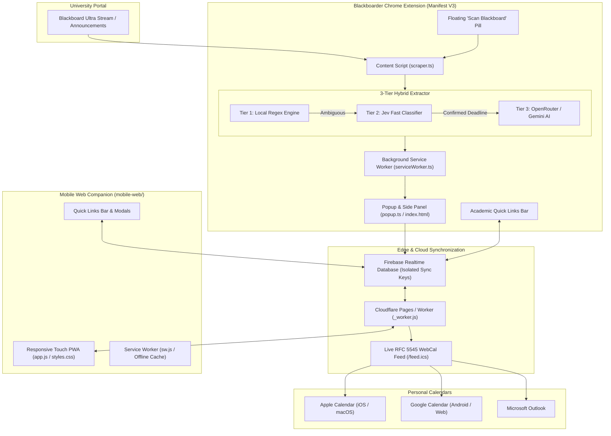

# ⚡ Blackboarder

<p align="center">
  
</p>

<p align="center">
  <strong>Smart Academic Companion & Deadline Intelligence for Blackboard Learn</strong>
</p>

<p align="center">
  <a href="#-quick-start--installation"></a>
  <a href="#-mobile-web-pwa--calendar-sync"></a>
  <a href="#-development--testing"></a>
  <a href="#-live-webcal-calendar-feed"></a>
  <a href="LICENSE"></a>
</p>

---

## 📖 Overview

**Blackboarder** is an academic productivity suite built for university students (optimized for **University of Sharjah / UOS** at `blackboard.sharjah.ac.ae` and standard Blackboard Learn / Ultra portals).

University course announcements often bury critical deadlines, quiz schedules, homework submissions, and exam room allocations inside conversational Arabic or English text. Blackboarder automatically extracts, categorizes, and organizes these dates into a unified schedule with **multi-user cloud synchronization**, an **offline-first Mobile Web PWA**, and a **live WebCal calendar feed (`.ics`)** that syncs with Apple Calendar, Google Calendar, and Outlook.

---

## 🌟 Key Features

### 1. 3-Tier Hybrid Extraction Pipeline
Combines ultra-fast local parsing, instant classification gatekeeping, and deep generative AI:
- **Tier 1: Local Regex Engine (0ms, Zero Network)**  
  Parses high-confidence English and Arabic keywords (*Quiz*, *Assignment*, *Project*, *Midterm*, *كويز*, *امتحان*, *واجب*), absolute/relative dates (`Oct 15`, `18/10/2026`, `next Sunday`), and explicit timestamps.
- **Tier 2: Jev System One Classifier (~100ms Gatekeeper)**  
  TypeSafe AI classifier that verifies whether an announcement contains an actionable deadline, categorizes task types, and filters out non-deadline announcements before making heavy API calls.
- **Tier 3: Generative AI Extraction (OpenRouter / Gemini 3.8 Flash Fallback)**  
  Synthesizes precise ISO timestamps, room numbers, and deliverables from multi-paragraph, ambiguous, or conversational announcements.

### 2. Academic Quick Links Bar
A direct access bar at the top of both the extension and mobile dashboard to quickly open essential university portals:
- **Marks & Grades Portal**
- **Attendance Records**
- **Degree Audit & Study Plan**
- **Library Resources**
- **Academic Advising**
- **Custom Links**: Add, edit, reorder, or delete custom links with instant local and cloud sync.

### 3. Chronological Time Ordering & Academic Calendar
- **Strict Chronological Sorting**: Tasks on any day are ordered from earliest to latest by specific time. Tasks automatically re-sort in real time whenever date or time details are edited.
- **Monday-First Academic Grid**: Standard Monday to Sunday academic week layout across both extension and mobile views.
- **Interactive Day Drawer**: Tap any calendar cell to slide out full details, syllabus weight, room number, doctor's announcement text, and student notes.

### 4. Student Room & Class Schedule Matcher
- Matches university course codes (e.g., `0401201`, `0402202`) with the student's registered lecture schedule, faculty timings, and assigned room locations.
- When an announcement omits a room number, Blackboarder cross-references the student's weekly schedule to identify where the quiz or lecture takes place.

### 5. Syllabus Weight & Grade Tracker
- Built-in syllabus database calculates the grade percentage impact for upcoming deliverables (e.g., *Midterm Exam (25%)*, *Quizzes (15%)*, *Lab Reports (10%)*).
- Displays weighted deliverables clearly on task cards and calendar summaries.

### 6. Private Multi-Tenant Cloud Sync
- **Personal Sync Keys**: Each installation receives an isolated 6-character sync key (such as `BBS-9A2K`).
- **Data Isolation**: Student data is partitioned into separate cloud endpoints (`/users/{syncKey}/data.json`), preventing cross-account collisions.
- **Bi-Directional Sync**: Edits made in the Chrome extension reflect instantly on the mobile web dashboard, and vice versa.

### 7. Real-Time RFC 5545 WebCal Feed (`.ics`)
- Generates live subscription feeds compatible with Apple Calendar (iOS / macOS), Google Calendar (Android / Web), and Microsoft Outlook.
- Changes made on Blackboard or edited locally update calendar subscriptions automatically through the background worker.

---

## 🏗️ Architecture



---

## 🚀 Quick Start & Installation

### Option 1: Chrome Extension (60 Seconds)

Compatible with **Google Chrome**, **Microsoft Edge**, **Brave**, **Opera**, and **Vivaldi**.

1. Download or clone this repository.
2. Run the production build or use the pre-built `dist/` directory:
   ```bash
   npm run build
   ```
3. Open the Extensions management page in your browser:
   - **Chrome**: `chrome://extensions`
   - **Edge**: `edge://extensions`
   - **Brave**: `brave://extensions`
4. Enable **Developer mode** in the top-right corner.
5. Click **Load unpacked** and select the `dist/` directory from this repository.
6. Pin **Blackboarder** to your browser toolbar.
7. Navigate to your university Blackboard portal (for UOS: `https://elearning.sharjah.ac.ae/ultra/stream`).
8. Click the floating **Scan Blackboard** button on the bottom right or press `Alt+B`.

### Option 2: Mobile Web PWA & Calendar Sync

The `mobile-web/` directory is a standalone Progressive Web App with offline caching and calendar feed generation.

#### Deploy to Cloudflare Pages (Recommended: 1 Minute)
1. Go to the [Cloudflare Dashboard](https://dash.cloudflare.com/) and navigate to **Workers & Pages**.
2. Click **Create Application** > **Pages** > **Upload assets**.
3. Select the `mobile-web/` directory and deploy.
4. Cloudflare provides a live HTTPS endpoint: `https://<your-project>.pages.dev`.

#### Deploy to Vercel or Netlify
```bash
# Vercel
npx vercel ./mobile-web

# Or drag-and-drop mobile-web/ into https://app.netlify.com/drop
```

#### Run Local Development Server
```bash
npm run server
```
Access the server locally at `http://localhost:3456` or over your local Wi-Fi from your smartphone.

---

## 📱 Pairing Your Phone & Subscribing to Calendars

1. Open the Blackboarder Chrome extension and switch to the **Settings** view.
2. Note your unique **Personal Sync Key** (such as `BBS-9A2K`).
3. Click **Copy Phone Pairing Link** and open that link on your phone.
4. Your mobile browser loads the dashboard, automatically pairs with your sync key, and saves it to offline storage.
5. On the mobile dashboard, tap **Add to Home Screen** to install it as a standalone app.
6. Tap **Subscribe in Apple / Google Calendar**:
   - **Apple Calendar**: Opens the native subscription prompt directly.
   - **Google Calendar**: Paste the URL into **Other calendars** > **From URL** in Google Calendar web.

---

## ⚙️ Configuration & AI API Keys

Blackboarder operates fully with local regex parsing out of the box. For advanced triage and ambiguous multi-paragraph extraction, configure API keys in extension Settings:

| Setting | Purpose | Default / Requirement |
| :--- | :--- | :--- |
| **OpenRouter API Key** | Powers Tier 3 generative AI fallback for unstructured announcements | Optional (`sk-or-v1-...`) |
| **AI Model** | Model selection for extraction | `google/gemini-3.8-flash` |
| **Jev API Key** | Low-latency (~100ms) deadline gatekeeper | Optional (`apikey_...`) |
| **Hosted Web URL** | Cloudflare Pages or self-hosted companion URL | `https://yassinr-uossidekick.pages.dev` |
| **Auto-Scan** | Automatically scans announcements on Blackboard page load | Enabled (`true`) |
| **Theme** | Light Mode, Dark Mode, or Match System | Light / Dark / System |

---

## 🧪 Development & Testing

The project includes an automated test suite covering regex parsing, AI triage, bi-directional synchronization, RFC 5545 calendar formatting, stress testing, and extension context recovery.

```bash
# Install dependencies
npm install

# Run full Vitest suite (22 test files, 189 passing tests)
npm test

# Build extension into dist/
npm run build

# Watch mode for extension development
npm run dev

# Bundle standalone Cloudflare Worker
npm run bundle:worker

# Package production release zips
npm run package
```

### Packaging Distribution Bundles

Running `npm run package` creates verified, production-ready archives in `release/`:
- **`blackboarder-extension.zip`**: Complete unpacked extension for direct student use.
- **`blackboarder-website.zip`**: Standalone PWA folder for drag-and-drop cloud hosting.
- **`blackboarder-full-product.zip`**: All product bundles, documentation, and guides.

---

## 📂 Project Directory Structure

```text
blackboarder/
├── assets/                       # Branding logos and graphic assets
│   └── logo.png                  # High-resolution Blackboarder insignia
├── cloudflare-worker/            # Serverless Edge deployment files
│   ├── worker.js                 # Standalone Edge worker
│   └── wrangler.toml             # Cloudflare configuration
├── dist/                         # Compiled Chromium extension bundle (Manifest V3)
│   ├── assets/                   # Compiled CSS and JS chunks
│   ├── icons/                    # Multi-resolution extension icons
│   ├── background.js             # Background service worker
│   ├── content.js                # In-page scraper and injector
│   ├── content.css               # Floating button and toast styling
│   └── manifest.json             # Extension manifest specification
├── mobile-web/                   # Standalone Progressive Web App
│   ├── _worker.js                # Cloudflare Pages edge backend
│   ├── app.js                    # Mobile client logic, quick links, sync
│   ├── index.html                # Responsive web app shell
│   ├── manifest.json             # PWA web manifest
│   ├── styles.css                # Responsive styles and design tokens
│   └── sw.js                     # Offline cache & push service worker
├── public/                       # Static source assets
│   ├── icons/                    # App icons (16, 32, 48, 128)
│   └── manifest.json             # Extension manifest template
├── scripts/                      # Build, bundle, and package scripts
│   ├── build.js                  # Vite extension compilation
│   ├── bundle-worker.js          # Cloudflare Worker code synthesis
│   ├── generate_icons.js         # Icon generation utility
│   └── package.js                # Release zip archive generator
├── server/                       # Node.js local LAN sync server
│   ├── calendarFeed.js           # RFC 5545 iCalendar feed engine
│   └── server.js                 # Express/HTTP server with Wi-Fi bridge
├── src/                          # Extension TypeScript source code
│   ├── background/               # Service worker background processes
│   ├── content/                  # DOM scrapers and floating widgets
│   ├── engine/                   # Local parser, Jev classifier, AI extractor
│   ├── popup/                    # Extension UI popup, calendar, quick links
│   ├── types.ts                  # Shared TypeScript interfaces
│   └── utils/                    # Firebase sync, storage, calendar helpers
├── tests/                        # Vitest automated test suite (189 tests)
├── HOSTING_GUIDE.md              # Detailed mobile web deployment guide
├── INSTALL_EXTENSION.md          # Visual browser installation guide for students
├── package.json                  # Dependencies and build scripts
└── README.md                     # Documentation
```

---

## 📄 License

This project is licensed under the [MIT License](LICENSE).
